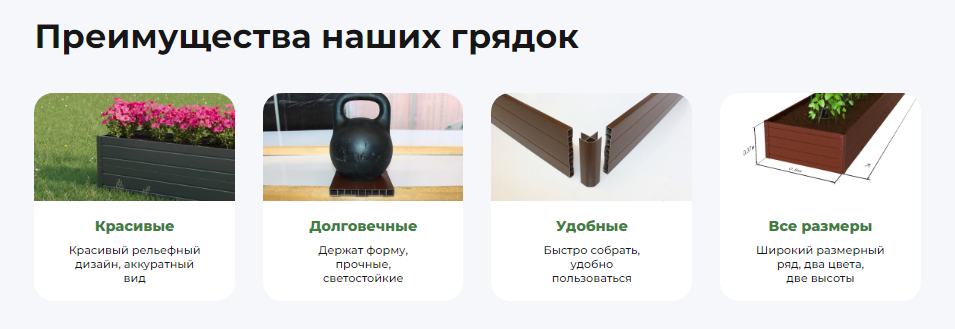

## Правки сайта "Грядки Клумбы"
<blockquote>
  29 октября совместно с Алексеем по телефону решили такими правками **не заниматься**, а после запуска сайта проводить **А/В тесты** с поледующей оценкой эффективности.
</blockquote>

- Дизайн уже **принят** и оплачен ещё 9 июля, а мы вновь возвращаемся назад
- Нет никакой **гарантии**, что новый блок будет работать лучше
- Лучше делать **А/В тесты** и потом оценивать эффективность

### 1. Блок Преимущества товаров

Нужно **связаться** с дизайнером сайта и дать ему Техзадание **переделать** блок.

### Техзадание

- Блок **не похож** на Преимущества, потому что там фотографии, а не схематичные иконки
- Из-за этого элементы блока похожи на **карточки товара** и вызывают желание **кликнуть**
- Он **мешает** восприятию и товаров, и самих преимуществ
- Поэтому нужно фото **поменять** на иконки
- и соответственно **переделать** весь дизайн этого блока, чтобы иконки смотрелись гармонично
